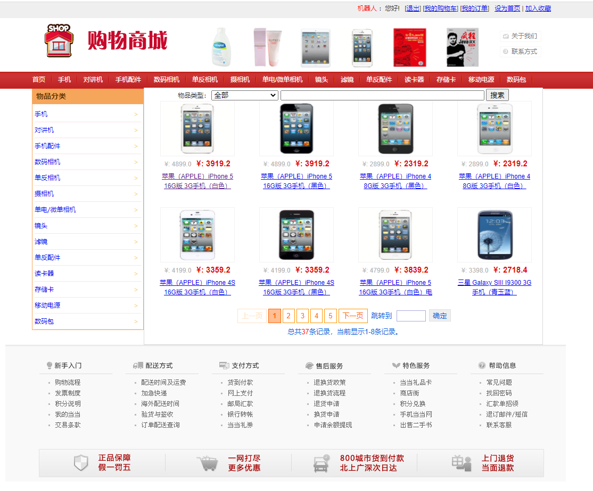
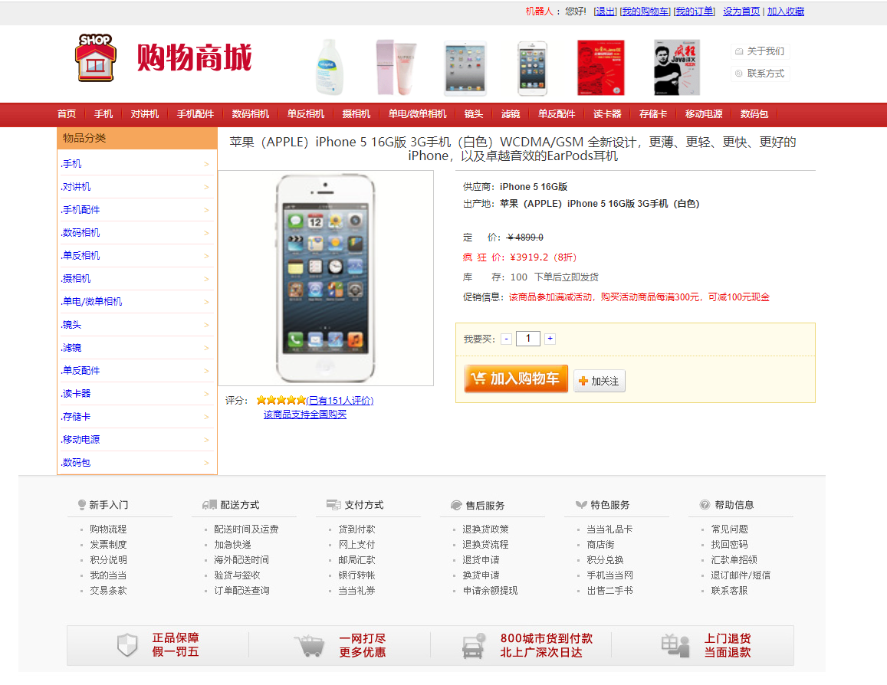
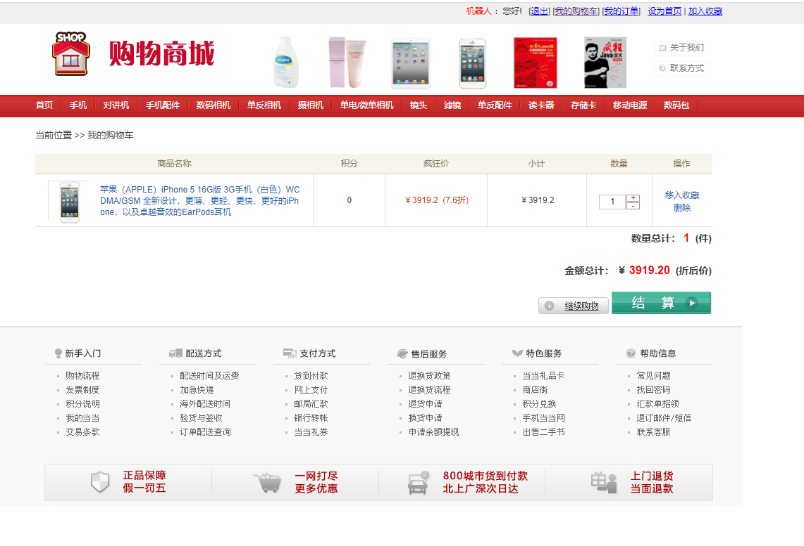
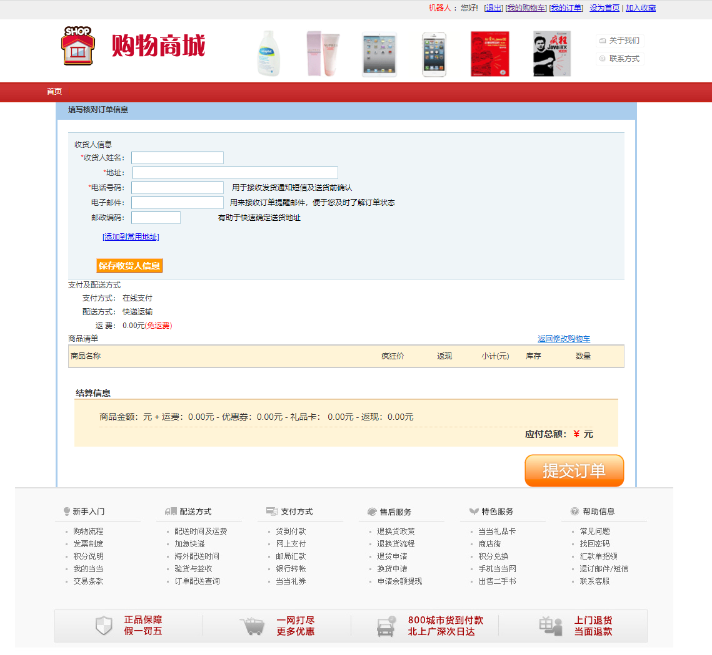
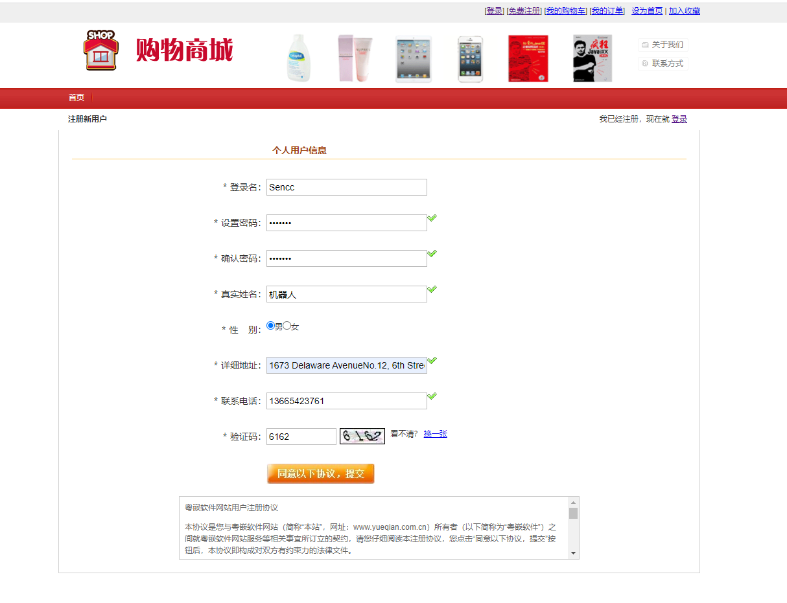

# 网上商城购物系统

<u>**如果该项目对你有帮助，可以点个Star**</u>

**该项目主要是完成网上商城购物系统的开发，该系统分为首页、用户管理、购物车管理、订单管理、登录注册5个模块。**

### 1.使用技术

主要使用了MVC设计模式，SSM框架、JSP、JavaScript、CSS等相关技术，数据库使用MySQL

### 2.简介

​	在首页模块实现了模糊分页查询、分类分页查询、查看商品详情等功能；用户管理模块实现了查看个人信息、收货地址修改等功能；购物车模块实现了查看、购买、修改数量等功能；订单模块实现了查看、删除等功能。还有些功能还没写完，没时间写了，基本功能已经完善，可以下载源码进行二次修改或者增加功能。

### 3.项目展示

### 4.运行

导入数据库**shop_db.sql**，在**jdbc.properties文件**修改链接数据库的信息 

bulid

